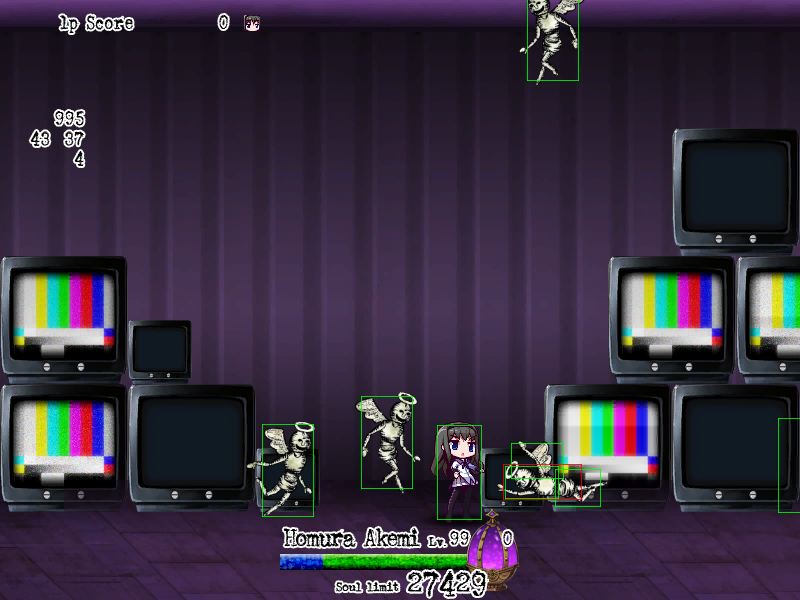
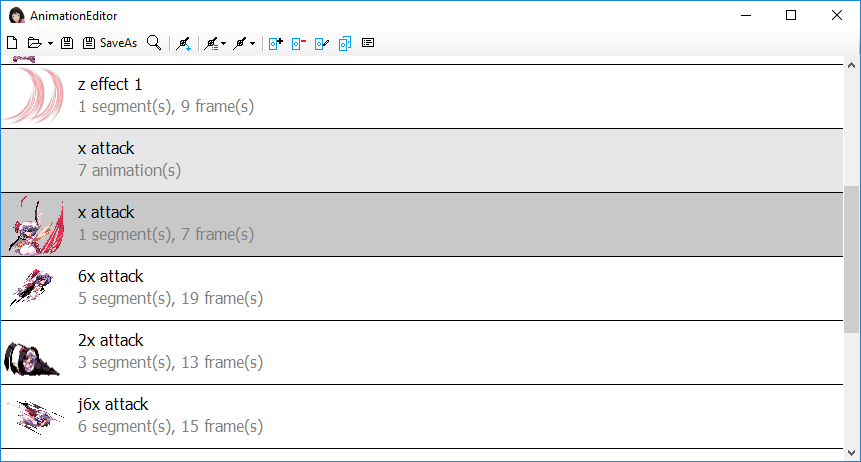
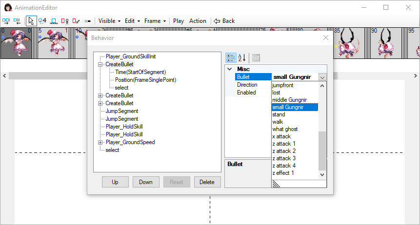
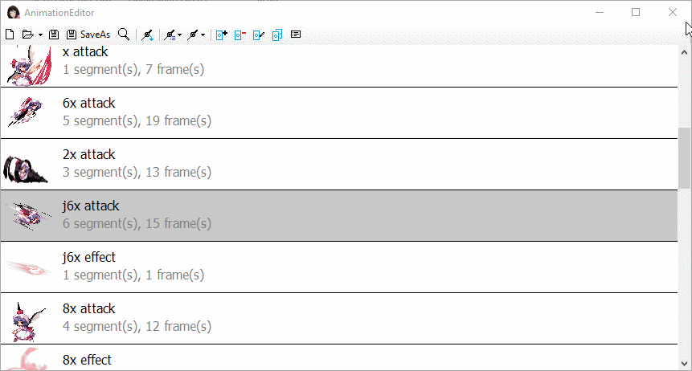
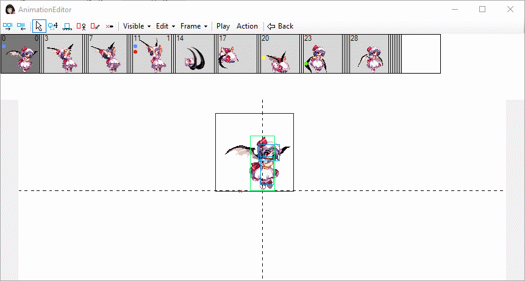

## Welcome to [Homukyo Studio](https://github.com/GriefSyndromeModderTools)

We are a group of people who are strongly interested in the game [Griefsyndrome](https://wiki.puella-magi.net/Grief_Syndrome) and programming. We have created many tools and mods for the game, including several new mod-loading systems, a new multiplayer plugin, a map editor, a character editor, several mods for the quarterly event, a new character mod (Remilia), and many others.

To allow other people to use some tools we've made, we publish some of our projects to this github organization.

### Members of Homukyo Studio
* [acaly](https://github.com/acaly)
* 小草 (Kusako)
* [夏幻](https://github.com/akemimadoka) (Natsu)
* 沙漠(Desert)
* xxx

## New packer (GS_Pack) and image converter (GS_Graph)
[GS_Pack](https://github.com/GriefSyndromeModderTools/GS_Pack) and [GS_Graph](https://github.com/GriefSyndromeModderTools/GS_graph) are the upgraded version of the tools in the [old toolkit](https://wiki.puella-magi.net/Talk:Grief_Syndrome#Mod_toolkit), GropeSyndrome and GraphSyndrome, respectively. These tools are instead based on command-line interface to facilitate automation. They also have some small bug fixes and new features (fix filename encoding in GropeSyndrome, add the support for transparent background in GraphSyndrome and reading and writing palette file).

## AML - Another Mod Loader (or Acaly's Mod Loader)
[AML](https://github.com/GriefSyndromeModderTools/AML2) is the second mod loading system we made for the game, which is a ported verson of [NML](https://github.com/GriefSyndromeModderTools/GSModloader) (Natsu's mod loader, our first mod loader, written in C++ and squirrel, named after the author Natsu) to C#. The idea is the same as the old multiplayer plugin and NML: injecting a native dll into the game process and modify the assembly code on the run. AML features an easy-to-use C# API and strong native and squirrel script modification functions. It significantly accelerates the developement of new plugins that requires a large amount of modification of native codes.

### Some projects that use AML:
**BP multiplayer plugin.** Using a specially improved communication protocol, it gives 2 times network delay tolerance compared with the old multiplayer plugin. It allows someone at the other side of the earth to play with friends in the other side with over 200 ms ping with little penalty in game experience.

**FPS accerator.** Increase the FPS to a higher value than the fixed 60. This gives the player more challenges when playing the game, and also allows the player to skip some part of the replay if used with the replay playing function. The same method can also make the game slower, but this is not implemented only to prevent the player from cheating.

**HitBoxVisualizer.** Inject into the game thread and hack into the collision system, which gives us the information about the collision box of each Actor (Actor is the name of entity in GS), and render the boxes on the screen using additional draw calls with the DirectX API. This help the user to know the exact position of the hit boxes, especially those of the bosses, which the only way to know previously is to 'feel'.

#### Screenshots (click for large image)

## PatEditor
[PatEditor](https://github.com/GriefSyndromeModderTools/GS_PatEditor) is an editor for in-game objects, mainly the characters. Although there is already an old editor for characters, it requires to manually change all parameters for all frames. As there are tonnes of numbers to change for even the simpliest animation, and even one mistake can crash the whole animation, this method proved ~~(mainly by Desert)~~ to be very unreliable and frustrating when we want to make new characters. The new editor is written from scratch. It tries to provide a WYSIWYG editing experience. The pictures, hitboxes, speeds of playing, loops, and even the logic that incoporates scripts, can all been edited and previewed before packing to a mod and starting the game. When publishing, besides the character animation file, the editor also automatically generates the squirrel script for the character. Ideally, we don't need to write any code to make a new character.

#### Screenshots (click for large image)

|||||
|------|------|------|------|
|Animation list|Animation editor|Preview|Animation editor|

## Remilia mod
Probably the most complicated project in Homukyo Studio. It adds a new character, Remilia (originally from Touhou Series) to the game. The pictures are from the game Touhou Hisotensoku. Thanks to the new editor, we were able to redesign every skill to make it compatible and balanced when moved to the game. The project is started by xxx, who did the majority work for the animation. It uses a character choosing screen and a packing tool written by Natsu and Kusako, and several pictures provided by Desert. Additional coding and debugging work is done by Acaly, and testing by many other players in our QQ group.

Mod preview (replay 2x): [https://www.bilibili.com/video/av15530055/](https://www.bilibili.com/video/av15530055/)

<video id="pelican-installation" class="video-js vjs-default-skin" controls
preload="auto" width="683" height="384" poster="https://hackercodex.com/static/screencasts/pelican-installation.png"
data-setup="{}">
<source src="https://hackercodex.com/screencasts/pelican-installation.mp4" type='video/mp4'>
</video>

## ActEditor
[ActEditor](https://github.com/GriefSyndromeModderTools/GS_ActEdit) is a map editor for the .act format map file used by Griefsyndrome. The map file format is reverse-engineered and we are now able to add new scenes to the game. However, due to the even larger amount of work to create a new scene compared with a new character, no one has ever successfully created a new scene yet. Hopefully someone in the future will have the time to do so.
